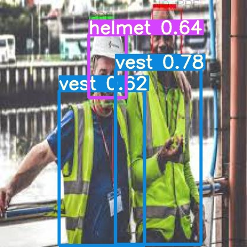
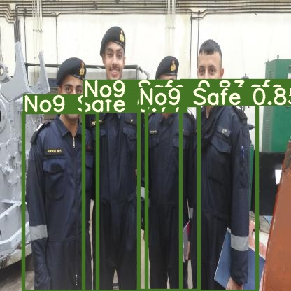

# PPE Detection using yolo5

## Introduction
In Industry, specially manufacturing industry, Personal Protective Equipment (PPE) like helmet (hard-hat), safety-harness, safty-vest, goggles etc play a very important role in ensuring the safety of workers. However, many accidents still occur, due to the negligence of the workers as well as their supervisors. Supervisors can make mistakes due to the fact that such tasks are monotonous and they may not be able to monitor consistently. This project aims to utilize existing CCTV camera infrastructure to assist supervisors to monitor workers effectively by providing them with real time alerts.

## Functioning
* Input is taken from Live feed
* YOLO is used for detecting persons with all the equipments
* The result of the detection is showed through text as well as pictorial form.

 
It detects persons without helmet and displays the number of persons with helmet and
those without helmet. It sends notification in the message box for each camera. There is global
message box, where alerts from all cameras are displayed.

 
It detects that the same person about which it had warned earlier has now worn a
helmet and notifies that also.

 

Please note that this is still a work under progress and new ideas and contributions are welcome.
* Currently, the model is trained to detect helmets (hard-hat) , safty-vest and No. 9 safty jacket (for navy officals). I have plans to train the model for other PPEs as well.
* Currently, only usb cameras are supported. Support for other cameras needs to be added.
* The tracker needs to be made robust.
* Integrate service (via mobile app or SMS) to send real-time notifications to supervisors present on the field.

## Training the model

### 1. Data preparation

**Data Collection**

The dataset containing images of people wearing helmets and people without helmets were collected mostly from google search. Some images have people applauding, those were collected from Stanford 40 Action Dataset. Download images for training from [train_image_folder](https://drive.google.com/drive/folders/1b5ocFK8Z_plni0JL4gVhs3383V7Q9EYH?usp=sharing).

**Annotations**

Annotaion of each image was done in Pascal VOC format using the awesome lightweight annotation tool [LabelImg](https://github.com/tzutalin/labelImg) for object-detection. Download annotations from [train_annot_folder](https://drive.google.com/drive/folders/1u_s_kxq0x_fqtqgJn9nKC92ikrThMDru?usp=sharing).

**Organize the dataset into 3 folders:**
* train_image_folder <= the folder that contains the train images.
* train_annot_folder <= the folder that contains the train annotations in VOC format.
* valid_image_folder <= the folder that contains the validation images.
* all therse folder should contain there anotated fills

There is a one-to-one correspondence by file name between images and annotations. If the validation set is empty, the training set will be automatically splitted into the training set and validation set using the ratio of 0.8.

The model section defines the type of the model to construct as well as other parameters of the model such as the input image size and the list of anchors. The `labels` setting lists the labels to be trained on. Only images, which has labels being listed, are fed to the network. The rest images are simply ignored. By this way, a Dog Detector can easily be trained using VOC or COCO dataset by setting `labels` to `['dog']`.

Download pretrained weights for backend at:
[helmet.pt](https://drive.google.com/file/d/189wETsNGWN8TwZpmQHFBFSzhag30LrjV/view?usp=sharing) 

[vest_helmet.pt](https://drive.google.com/file/d/1VzkhAU5UPXun3pfx5yllo7TV20hHU8Th/view?usp=sharing)

**These weights must be put in the root folder of the repository. They are the pretrained weights for the backend only and will be loaded during model creation. The code does not work without these weights.**

### 2. Start the training process

`python train.py n`

By the end of this process, the code will write the weights of the best model to file best_weights.h5 (or whatever name specified in the setting "saved_weights_name" in the config.json file). The training process stops when the loss on the validation set is not improved in 3 consecutive epoches.
 
 ### 3. Perform detection using trained weights on live feed from webcam
 `detection_helmet.py`
 The trained weighets can be used in local inviorm=nment as well as on google colab.

## Acknowledgements

* [ultralytics/yolov5](https://github.com/ultralytics/yolov5) for training data.

